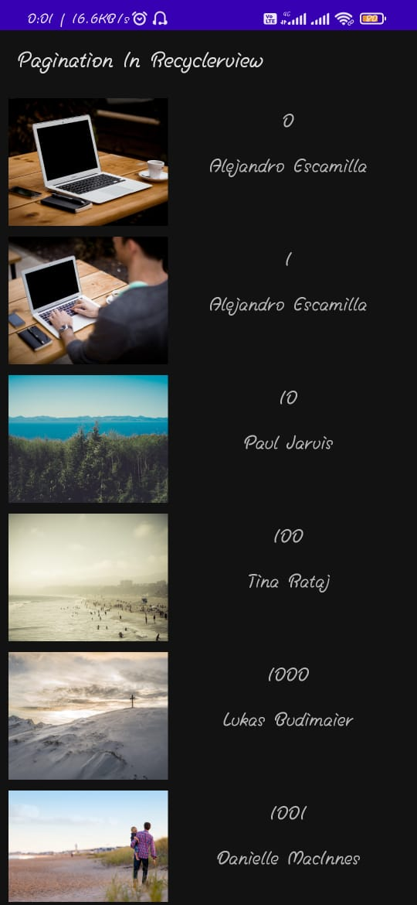
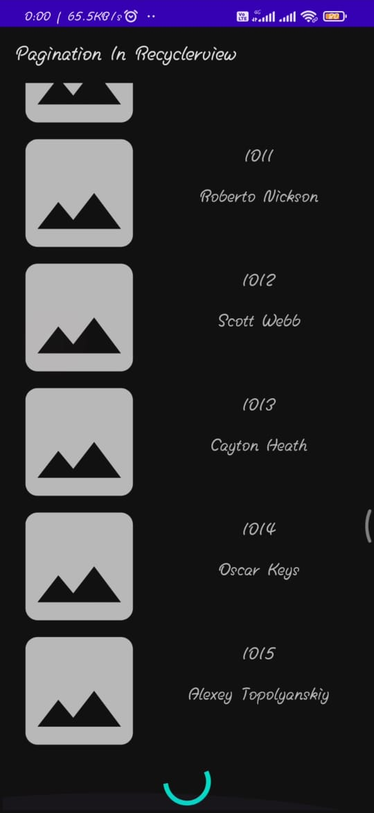

# Pagination-In-RecyclerView

This project helps how to implement pagination in RecyclerView

> In Android, Pagination is a very common feature for heavy-data apps today. It’s also called endless scrolling or infinite scrolling. You want to fetch all data of feed at once and bind with the view, which could time-consuming and your app will appear as running slow. Pagination is used for better user experience and resource management. It has broken down a list of content into equal smaller pieces, loaded one at a time.

---

# Screenshots

<figure>
    
    <figcaption>Completely loaded images from server.</figcaption>
</figure>

<figure>
    
    <figcaption>Loading New items when scrolled to last position.</figcaption>
</figure>
<video width="400" height="250" controls>
  <source src="screenshots/DemoVideo.mp4" type="video/mp4">
</video>

## Thanks for reading💯💯

### If you found anything wrong or should be implemented for efficiency, you are welcome to submit a pull request👍.
